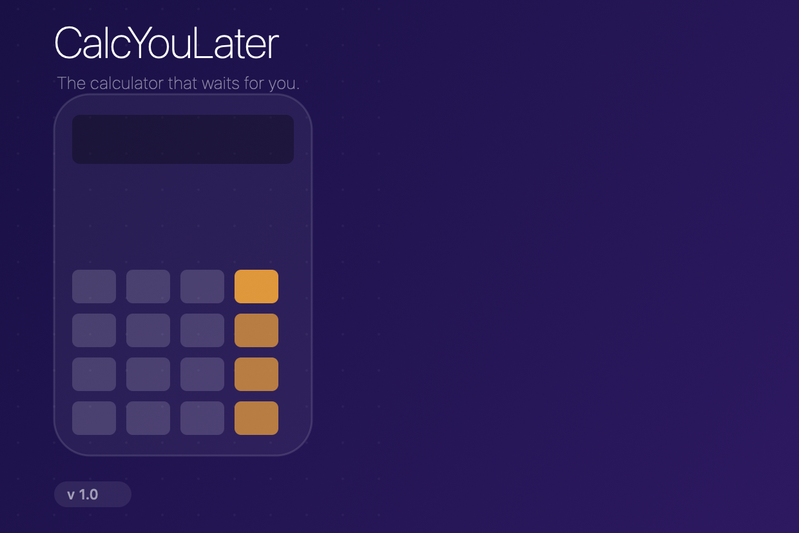
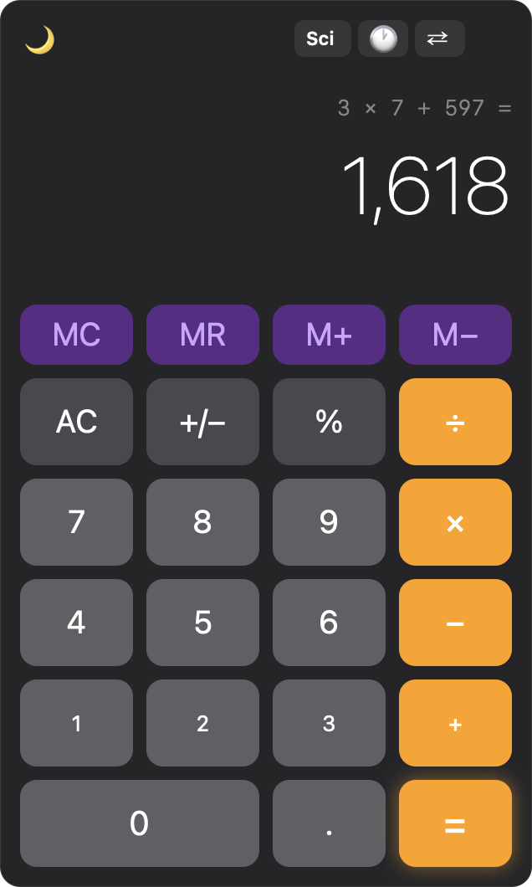
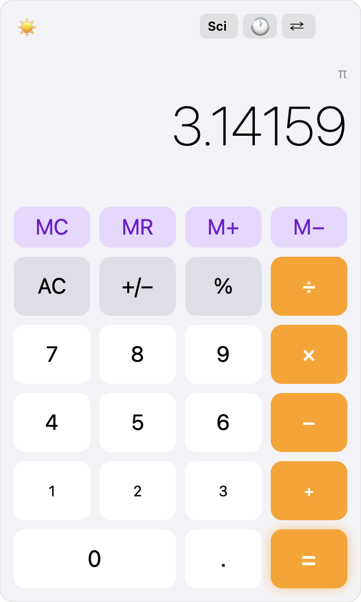
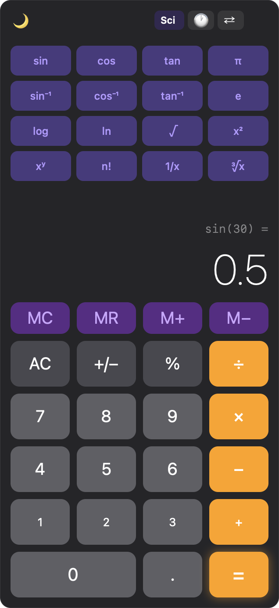
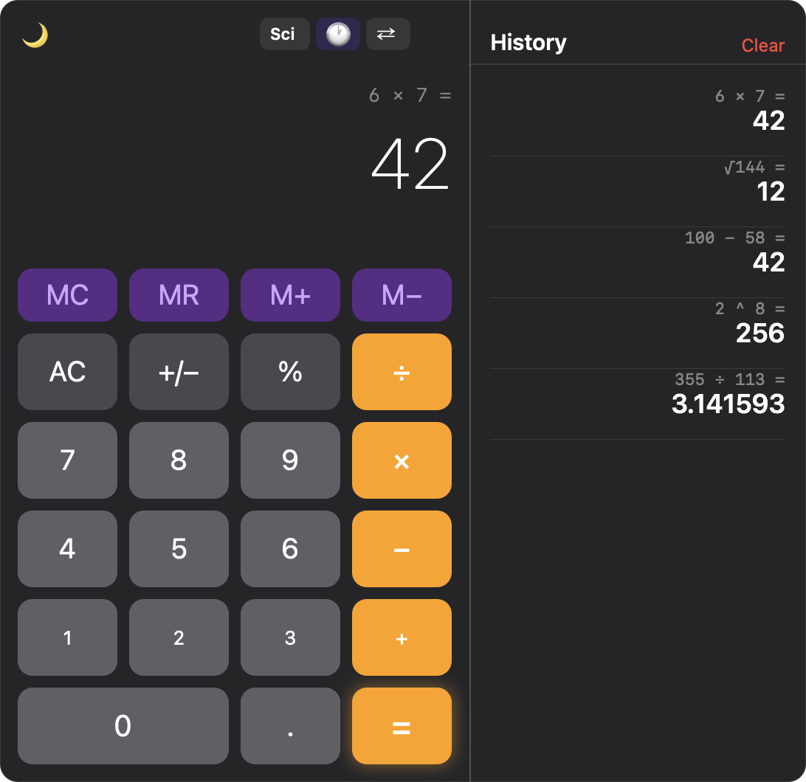
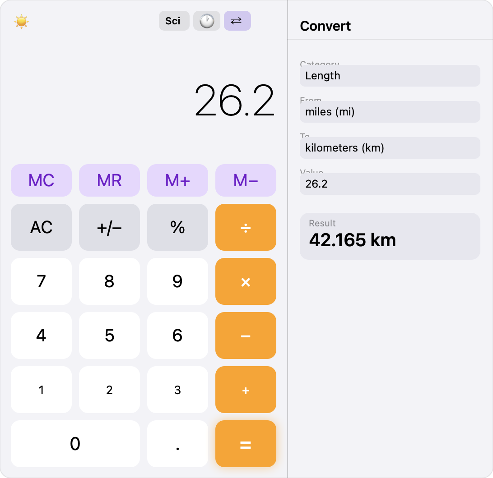
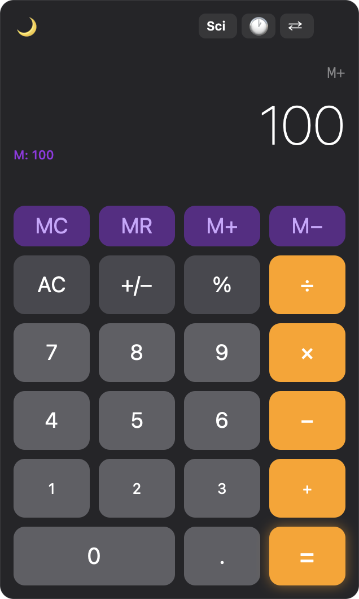

<div align="center">



# CalcYouLater

**The calculator that waits for you.**

[](https://developer.apple.com/macos/)
[](https://swift.org)
[](https://developer.apple.com/xcode/swiftui/)
[](LICENSE)
[](../../releases)

A native macOS calculator with a scientific mode, calculation history, unit converter, full keyboard support, and a witty name.

[**Download Installer (.pkg)**](../../releases/latest) · [**View Source**](CalcYouLater/) · [**Report Bug**](../../issues)

</div>

---

## Screenshots

<div align="center">

### Standard Mode

| Dark | Light |
|:----:|:-----:|
|  |  |

### Scientific Mode



*16 functions — sin/cos/tan/log/ln/√/xʸ/n!/π/e and more*

### History & Unit Converter

| History Sidebar | Unit Converter |
|:---------------:|:--------------:|
|  |  |

### Memory Functions



</div>

---

## Features

### 🧮 Calculator Core
- Full arithmetic with **chained operations** and repeated `=`
- Backspace, sign toggle, percentage
- **Keyboard-first** — every key you'd expect works

### 🔬 Scientific Mode
Toggle the **Sci** button to reveal 16 functions arranged in a clean grid above the keypad:

| Row | Functions |
|-----|-----------|
| Trig | `sin` `cos` `tan` `π` |
| Inverse | `sin⁻¹` `cos⁻¹` `tan⁻¹` `e` |
| Log / Power | `log` `ln` `√` `x²` |
| Extra | `xʸ` `n!` `1/x` `∛x` |

### 📋 History
- Every calculation is saved automatically (up to 200 entries)
- **Tap any entry** to recall its result
- **Swipe to delete** individual entries
- **Clear All** button for a fresh start

### ⇄ Unit Converter
Six categories, 40+ units — pull the current display value in with one click:

| Category | Units |
|----------|-------|
| Length | m, km, cm, mm, mi, ft, in, yd |
| Weight | kg, g, lb, oz, t, mg |
| Temperature | °C, °F, K |
| Area | m², km², cm², ft², in², ha, acre |
| Volume | L, mL, gal, fl oz, cup, tbsp, tsp, m³ |
| Speed | m/s, km/h, mph, knot, ft/s |

### 🧠 Memory
`MC` · `MR` · `M+` · `M−` — purple memory indicator shows stored value

### 🌗 Appearance
System default · Light · Dark — persisted across launches

---

## Keyboard Shortcuts

| Key | Action |
|-----|--------|
| `0` – `9` | Digits |
| `+ - * /` | Operators |
| `Enter` or `=` | Equals |
| `.` | Decimal point |
| `Delete` | Backspace |
| `Esc` | Clear all |
| `%` | Percent |
| `c` / `C` | Clear |
| Click result | Copy to clipboard |

---

## Installation

### Option A — Installer package (recommended)

1. Download `CalcYouLater_Installer.pkg` from [Releases](../../releases/latest)
2. Double-click and follow the on-screen installer
3. Open **CalcYouLater** from `/Applications` or Spotlight

> The installer automatically removes the quarantine flag so the app opens without any Gatekeeper warning.

### Option B — Build from source

**Requires:** macOS 13+, Xcode 15+

```bash
git clone https://github.com/clawedcode-git/CalcYouLater.git
cd CalcYouLater
open CalcYouLater.xcodeproj   # then ⌘R in Xcode
```

**Or compile with swiftc (no Xcode needed):**

```bash
mkdir -p build/CalcYouLater.app/Contents/MacOS
swiftc -parse-as-library -target arm64-apple-macosx13.0 \
  CalcYouLater/*.swift \
  -o build/CalcYouLater.app/Contents/MacOS/CalcYouLater
cp dist/resources/*.* build/CalcYouLater.app/Contents/Resources/
open build/CalcYouLater.app
```

---

## Installing the App on a Mac

| Scenario | Solution |
|----------|----------|
| Installed via `.pkg` | ✅ Works out of the box — quarantine removed by installer |
| Downloaded `.app` directly | Right-click → **Open**, then click **Open** in the dialog |
| Terminal override | `xattr -dr com.apple.quarantine /Applications/CalcYouLater.app` |
| Full notarization | Requires Apple Developer account ($99/yr) + `xcrun notarytool` |

---

## Project Structure

```
CalcYouLater/
├── CalcYouLater.xcodeproj/        Xcode project
├── CalcYouLater/
│   ├── CalcYouLaterApp.swift      App entry point, appearance binding
│   ├── CalculatorEngine.swift     All calculation logic & state machine
│   ├── ContentView.swift          Main layout, keypad, keyboard handler
│   ├── HistoryView.swift          History sidebar
│   ├── ScientificKeypad.swift     Scientific function panel
│   ├── ConverterView.swift        Unit converter sidebar
│   └── Assets.xcassets/           App icon & accent colour
├── dist/                          Installer resources & scripts
├── generate_icon.swift            Icon generator (AppKit drawing)
├── generate_installer_bg.swift    Installer background generator
├── generate_mockups.swift         README screenshot generator
└── CalcYouLater_Installer.pkg     Distributable installer
```

---

## License

MIT — do whatever you want, just don't remove the pun.

---

<div align="center">
<sub>Built with SwiftUI · Runs natively on Apple Silicon & Intel · No telemetry, no dependencies</sub>
</div>
