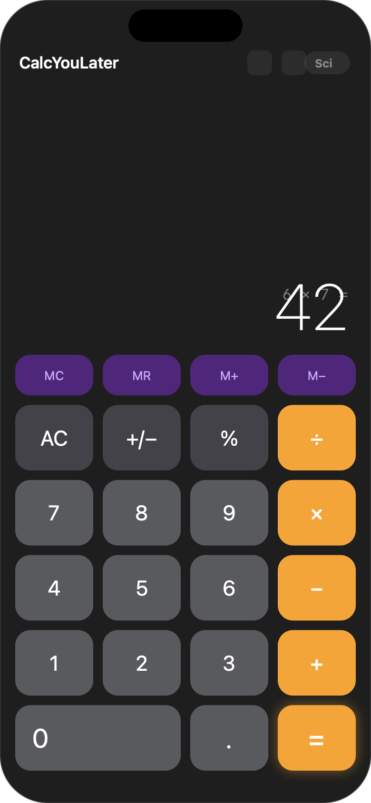
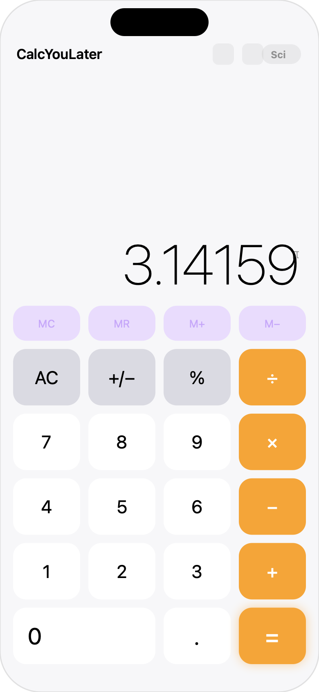
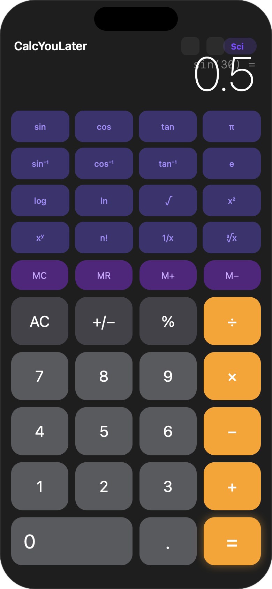
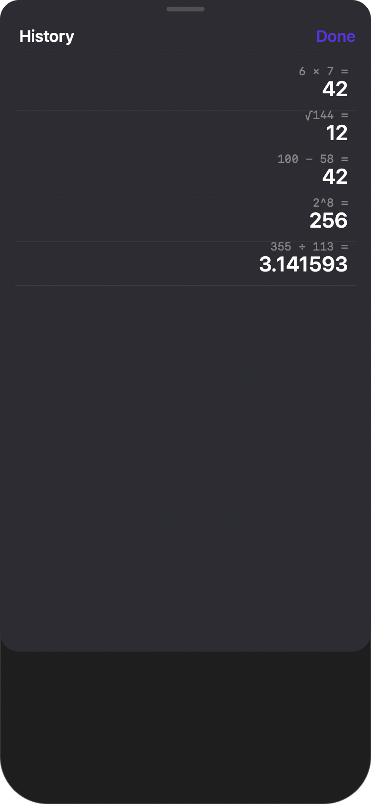
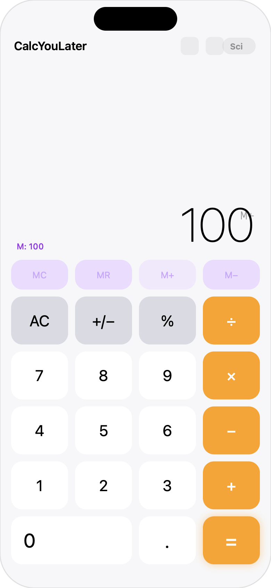
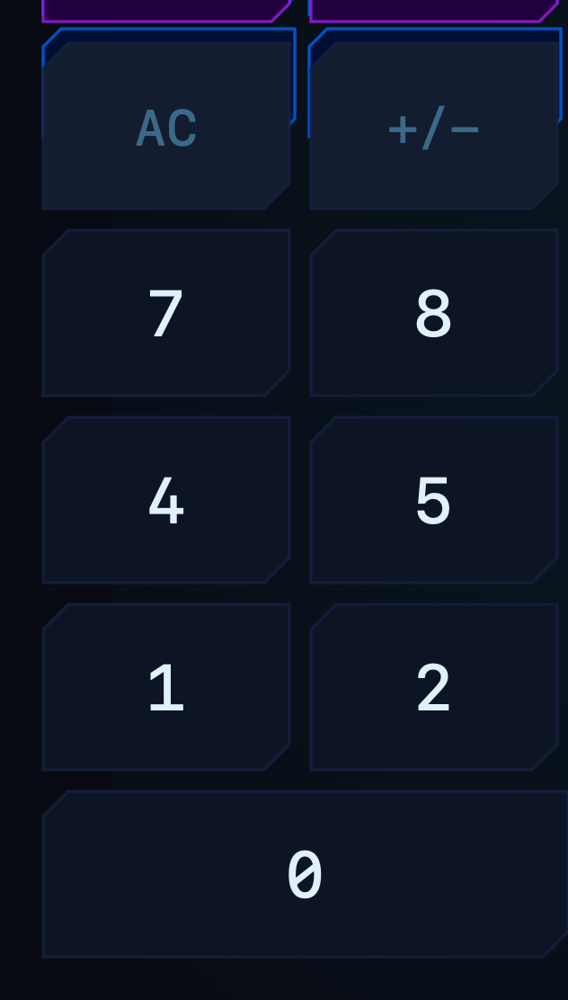

<div align="center">


# CalcYouLater

**The calculator that waits for you.**

[](https://developer.apple.com/macos/)
[](https://developer.apple.com/ios/)
[](https://swift.org)
[](https://developer.apple.com/xcode/swiftui/)
[](LICENSE)
[](../../releases/latest)
[](https://neonbladeui.neuronrush.com)

A native calculator for **macOS and iOS/iPadOS** — scientific mode, history, unit converter, memory functions, keyboard support, and a witty name.

[**⬇ macOS Installer (.pkg)**](../../releases/latest) · [**⬇ iOS (.ipa)**](../../releases/latest) · [**Report Bug**](../../issues)

</div>

---

## Downloads

| Platform | File | Requirements | How to install |
|----------|------|-------------|----------------|
| **macOS** | `CalcYouLater_Installer.pkg` | macOS 13 Ventura+ | Double-click → follow installer |
| **iOS / iPadOS** | `CalcYouLater-iOS.ipa` | iOS / iPadOS 16+ · arm64 | Sideload via AltStore or Sideloadly |
| **iOS Source** | `CalcYouLater-iOS-src.zip` | Xcode 15+ | Open `.xcodeproj` → ⌘R |

→ All assets on the **[v1.0 Release page](../../releases/latest)**

---

## Screenshots

### macOS

<div align="center">

| Dark Mode | Light Mode |
|:---------:|:----------:|
|  |  |

| Scientific Mode | History Sidebar | Unit Converter |
|:--------------:|:---------------:|:--------------:|
|  |  |  |

</div>

---

### iOS / iPadOS

<div align="center">

| Portrait Dark | Portrait Light | Scientific | History | Memory |
|:---:|:---:|:---:|:---:|:---:|
|  |  |  |  |  |

*In landscape, the scientific panel moves to its own column alongside the keypad.*

</div>

---

## Features

### 🧮 Calculator Core
- Full arithmetic with **chained operations** and repeated `=`
- Backspace, sign toggle, percentage
- **Keyboard-first on macOS** — every key you'd expect works
- **Haptic feedback on iOS** — tactile response on every tap

### 🔬 Scientific Mode
Toggle **Sci** to reveal 16 functions:

| Row | Functions |
|-----|-----------|
| Trig | `sin` `cos` `tan` `π` |
| Inverse Trig | `sin⁻¹` `cos⁻¹` `tan⁻¹` `e` |
| Log / Power | `log` `ln` `√` `x²` |
| Extra | `xʸ` `n!` `1/x` `∛x` |

> **On iOS in landscape**, the scientific panel appears as a permanent left column — no toggle needed.

### 📋 History
- Every calculation saved automatically (up to 200 entries)
- **Tap any entry** to recall its result into the display
- **Swipe to delete** individual entries · **Clear All** button
- macOS: slide-in sidebar — iOS: native sheet

### ⇄ Unit Converter
Six categories, 40+ units. Tap **←** (iOS) or **↓** (macOS) to pull the current display value directly in.

| Category | Units |
|----------|-------|
| Length | m, km, cm, mm, mi, ft, in, yd |
| Weight | kg, g, lb, oz, t, mg |
| Temperature | °C, °F, K |
| Area | m², km², cm², ft², in², ha, acre |
| Volume | L, mL, gal, fl oz, cup, tbsp, tsp, m³ |
| Speed | m/s, km/h, mph, knot, ft/s |

### 🧠 Memory
`MC` · `MR` · `M+` · `M−` — purple indicator in display shows stored value

### 🌗 Appearance
System default · Light · Dark — persisted across launches

### ⚡ NeonBlade Theme
A full **cyberpunk / sci-fi** skin powered by the [NeonBlade UI](https://neonbladeui.neuronrush.com) aesthetic.

<div align="center">

| Standard Dark | NeonBlade |
|:---:|:---:|
|  |  |

</div>

**Toggle:** Click the **`⚡`** bolt button in the toolbar, or press `⌘⇧T`

| Element | NeonBlade Style |
|---------|----------------|
| Button shape | Diagonal **corner-cut** (blade geometry) |
| Operators | Electric cyan `#00d4ff` with neon glow |
| Equals | Hot pink `#ff0066` with neon glow |
| Memory | Electric violet `#a020f0` |
| Scientific | Electric blue `#0066ff` |
| Window | Deep space `#080b14` |
| Display | Scanline overlay · cyan border panel |
| Fonts | Monospaced throughout — terminal aesthetic |
| Hover | Glow intensifies + border brightens |

Theme is **persistent** across launches and always forces **dark mode**.

---

## macOS Keyboard Shortcuts

| Key | Action |
|-----|--------|
| `0` – `9` | Digits |
| `+ - * /` | Operators |
| `Enter` or `=` | Equals |
| `.` | Decimal point |
| `Delete` | Backspace |
| `Esc` | Clear all |
| `%` | Percent |
| `c` / `C` | Clear |
| Click result | Copy to clipboard |

---

## Installation

### macOS — Installer package

1. Download **`CalcYouLater_Installer.pkg`** from [Releases](../../releases/latest)
2. Double-click and follow the on-screen installer — app lands in `/Applications`
3. Open from Launchpad or Spotlight

> The installer removes the quarantine flag automatically, so the app opens with no Gatekeeper warning.

### iOS / iPadOS — Sideloading the IPA

The IPA is **ad-hoc signed** (no App Store). Choose a sideloading method:

| Tool | Cost | Notes |
|------|------|-------|
| **[AltStore](https://altstore.io)** | Free | Installs via Wi-Fi · re-signs every 7 days with your Apple ID |
| **[Sideloadly](https://sideloadly.io)** | Free | Drag-and-drop IPA · USB or Wi-Fi |
| **Xcode** | Free (Xcode required) | Devices & Simulators → drag IPA onto device · needs Developer Mode on |

> Enable **Developer Mode** on iPhone/iPad: Settings → Privacy & Security → Developer Mode.

### iOS — Build from source

**Requires:** macOS + Xcode 15+

```bash
# Clone and build
git clone https://github.com/clawedcode-git/CalcYouLater.git
open CalcYouLater-iOS/CalcYouLater-iOS.xcodeproj
# Select your device → ⌘R
```

---

## Allowing the macOS App on Any Mac

| Scenario | Solution |
|----------|----------|
| Installed via `.pkg` | ✅ Works — quarantine removed by installer |
| Copied `.app` directly | Right-click → **Open** → click **Open** in dialog |
| Terminal override | `xattr -dr com.apple.quarantine /Applications/CalcYouLater.app` |
| Full Gatekeeper approval | Requires Apple Developer account + `xcrun notarytool` notarisation |

---

## Project Structure

```
CalcYouLater/                        macOS Xcode project
├── CalcYouLater.xcodeproj/
├── CalcYouLater/
│   ├── CalcYouLaterApp.swift        App entry · appearance & theme binding
│   ├── AppTheme.swift               NeonBlade theme system · CornerCutShape · colors
│   ├── CalculatorEngine.swift       All calculation logic (shared)
│   ├── ContentView.swift            Main layout · keypad · keyboard handler
│   ├── HistoryView.swift            History sidebar
│   ├── ScientificKeypad.swift       Scientific function panel
│   ├── ConverterView.swift          Unit converter sidebar
│   └── Assets.xcassets/
├── dist/                            Installer resources & postinstall script
├── screenshots/                     macOS & iOS mockups
├── generate_icon.swift              App icon generator (AppKit)
├── generate_installer_bg.swift      Installer background generator
├── generate_mockups.swift           macOS screenshot generator
├── generate_ios_mockups.swift       iOS screenshot generator
└── CalcYouLater_Installer.pkg       Distributable macOS installer

CalcYouLater-iOS/                    iOS / iPadOS Xcode project
├── CalcYouLater-iOS.xcodeproj/
└── CalcYouLater-iOS/
    ├── CalcYouLaterApp.swift
    ├── CalculatorEngine.swift       Shared with macOS (pure Swift / Foundation)
    ├── ContentView.swift            Touch UI · portrait + landscape layouts
    ├── HistoryView.swift            History sheet
    └── ConverterView.swift          Converter sheet (Form-based)
```

---

## License

MIT — do whatever you want, just don't remove the pun.

---

<div align="center">
<sub>Built with SwiftUI · macOS (Apple Silicon & Intel) · iOS / iPadOS (arm64) · NeonBlade theme · No telemetry · No dependencies</sub>
</div>
